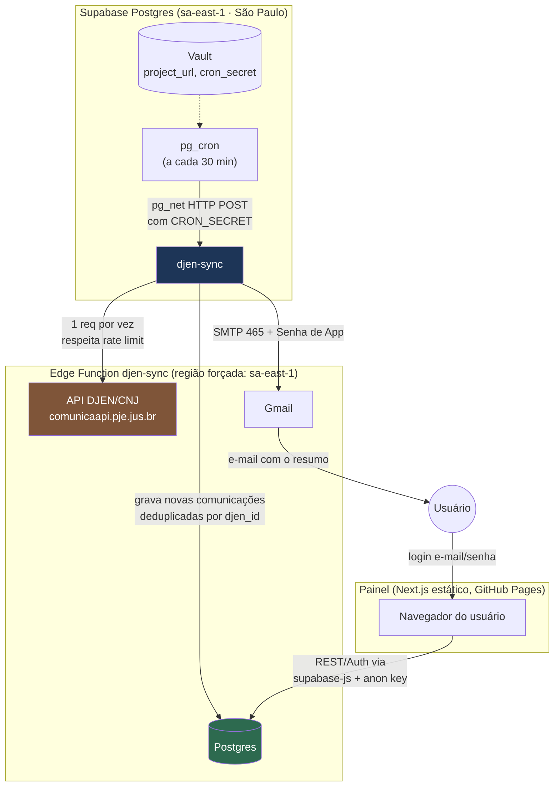

# DJEN Monitor

Monitora publicações processuais no **DJEN** (Diário de Justiça Eletrônico
Nacional, API pública do CNJ) para uma lista de OABs, advogados, partes,
processos ou termos de busca — e avisa por e-mail quando sai algo novo.

Roda inteiramente em serviços com plano gratuito: banco e automação no
**Supabase**, painel estático no **GitHub Pages**, notificações por
**Gmail**. Não há servidor para manter no ar nem Vercel envolvido.

## O que é

- Uma **Edge Function** (`djen-sync`) consulta periodicamente a API pública
  `GET https://comunicaapi.pje.jus.br/api/v1/comunicacao` para cada monitor
  cadastrado, grava as comunicações novas no banco e envia um e-mail
  resumindo o que apareceu.
- Um **painel web** (Next.js, estático) para cadastrar monitores, ver o
  histórico de comunicações e acompanhar as execuções da sincronização.
  Login único (cadastro público desativado) — é uma ferramenta pessoal, não
  multiusuário.
- Um **agendador** (`pg_cron` + `pg_net`, dentro do próprio Postgres do
  Supabase) chama a Edge Function a cada 30 minutos.

## Arquitetura



Fluxo de um ciclo: o `pg_cron` dispara a cada 30 minutos, chama a Edge
Function via `pg_net` (autenticando com o `cron_secret` guardado no Vault),
a função busca as comunicações de cada monitor ativo na API do DJEN, grava
as que ainda não existem (deduplicação por `djen_id`) e dispara um e-mail
por Gmail SMTP resumindo as novidades. O painel apenas lê/escreve no mesmo
Postgres via `supabase-js`, sem back-end próprio.

## Limites da API do DJEN e como o sistema lida com cada um

A API pública do DJEN/CNJ é generosa, mas tem regras estritas. Cada uma
delas tem uma contrapartida deliberada no design deste sistema:

| Limite da API | Como o DJEN Monitor lida com isso |
| --- | --- |
| **20 requisições por janela, por IP** (`x-ratelimit-limit`/`remaining` nos headers) | A função consome os monitores um de cada vez, olhando o cabeçalho de limite restante a cada resposta; se o orçamento da execução acabar, ela para e retoma exatamente de onde parou na próxima chamada do cron (30 min depois) — nunca insiste na mesma janela. |
| **HTTP 429 (limite estourado)** | A função trata 429 como sinal para aguardar (a documentação recomenda 1 min) e não como erro fatal; a execução é marcada como "parcial" e o restante fica para a próxima rodada, em vez de falhar tudo. |
| **Múltiplos IPs para contornar o limite = abuso/bloqueio** | O sistema **nunca** rotaciona IPs. A Edge Function é forçada a rodar na região `sa-east-1` (São Paulo), então **todas** as chamadas saem de um único IP de saída da infraestrutura da Supabase naquela região — simples, previsível e dentro das regras. O efeito colateral é que esse IP é compartilhado com outras Edge Functions de outros projetos na mesma região; se ele estiver "gasto" por terceiros, pode vir 429 mesmo sem culpa deste sistema — daí a importância de o sistema se recuperar sozinho (itens acima) em vez de tentar burlar o limite. |
| **Consultas por OAB/nome/texto/intervalo de datas limitadas a 10.000 resultados** | Monitores com muito volume (ex.: nome comum, tribunal inteiro) devem usar `dias_retroativos` pequeno e, se possível, filtrar por tribunal (`sigla_tribunal`). A função busca **um dia por vez apenas quando necessário** (ex.: quando o monitor tem uma janela retroativa maior, para não estourar o limite de 10 mil num intervalo largo), em vez de sempre pedir o intervalo inteiro de uma vez. |
| **`itensPorPagina` só aceita 5 ou 100** | A função sempre usa 100 (o maior lote permitido), para gastar o mínimo de requisições possível dentro do limite de 20 por janela. |
| **Endpoint alternativo `/api/v1/caderno/{tribunal}/{data}/{meio}`** (baixa o caderno/diário inteiro) | Não é usado no fluxo padrão (pensado para monitores pontuais), mas é a alternativa recomendada caso você queira monitorar **tribunais inteiros** em alto volume — ver seção "Recomendações". |
| **Localização geográfica** (a API está sujeita a variações por origem da requisição) | O projeto Supabase e a Edge Function são fixados na região **South America (São Paulo)** desde a criação, garantindo IP brasileiro de forma consistente. |

Adicionalmente, o `pg_cron` roda a cada 30 minutos, mas o Diário de Justiça
Eletrônico só é publicado **uma vez por dia** — então não há motivo para
consultar com mais frequência que isso; 30 min é apenas para não depender de
um único horário fixo (ver "Recomendações").

## Passo a passo de implantação (para quem nunca fez isso)

Pré-requisitos: conta no [Supabase](https://supabase.com), conta no
[GitHub](https://github.com) e uma conta Gmail com **verificação em 2 etapas
ativada**. Tudo cabe no plano gratuito de cada serviço.

### 1. Criar o projeto no Supabase

1. Entre em [supabase.com](https://supabase.com) → **New project**.
2. Em **Region**, escolha **South America (São Paulo)** — é essencial para
   o IP de saída da função ser brasileiro (ver seção de limites acima).
3. Anote a **senha do banco** que você definir — vai precisar dela nos
   próximos passos.

### 2. Desativar o cadastro público e criar seu usuário

1. No painel do Supabase, vá em **Authentication → Providers → Email** e
   desative "Allow new users to sign up" (cadastro público desativado —
   este sistema é de uso pessoal).
2. Vá em **Authentication → Users → Add user** e crie seu próprio usuário
   (e-mail e senha) — será o login do painel.

### 3. Gerar a Senha de App do Gmail

1. Confirme que a **verificação em 2 etapas** está ativada na sua conta
   Google (é pré-requisito).
2. Acesse <https://myaccount.google.com/apppasswords> e gere uma senha de
   app (ex.: nome "DJEN Monitor"). Guarde o valor gerado — ele só aparece
   uma vez.

### 4. Publicar o banco e a Edge Function

> **No projeto "Sistema Processuais" isto já foi
> feito**: esquema e agendamento aplicados, segredos do Vault criados e função
> publicada. Falta só o passo 4.3 (credenciais do Gmail).

1. Crie os segredos do Vault no **SQL Editor** (o `cron_secret` é gerado
   aleatoriamente dentro do banco — ninguém precisa vê-lo):

   ```sql
   select vault.create_secret('https://SEU_PROJECT_REF.supabase.co', 'project_url');
   select vault.create_secret(encode(extensions.gen_random_bytes(32), 'hex'), 'cron_secret');
   ```

2. Publique banco e função pelo terminal, dentro da pasta do projeto:

   ```powershell
   npx supabase login
   npx supabase link --project-ref SEU_PROJECT_REF
   npx supabase db push
   npx supabase functions deploy djen-sync --use-api --no-verify-jwt
   ```

   O `SEU_PROJECT_REF` está em **Project Settings → General → Reference ID**.
   A função lê o `cron_secret` direto do Vault (RPC `djen_cron_secret`, só
   executável pela service role), então **não** é preciso definir
   `CRON_SECRET` nos segredos da função.

3. Cadastre as credenciais do Gmail em **Edge Functions → Secrets** no
   painel da Supabase (ou `npx supabase secrets set ...`):

   | Nome | Valor |
   | --- | --- |
   | `GMAIL_USER` | seu endereço Gmail (remetente) |
   | `GMAIL_APP_PASSWORD` | a Senha de App do passo 3 (16 letras, sem espaços) |
   | `EMAIL_FROM_NAME` | opcional, ex.: `DJEN Monitor` |

### 5. Definir para quem vão os e-mails

No painel, em **Configurações**, preencha os **e-mails padrão** (quem recebe
as notificações). Cada monitor também pode ter destinatários próprios.

### 6. Publicar o painel no GitHub

1. Crie um repositório no GitHub e suba este projeto (`git push`).
2. Em **Settings → Pages**, em "Build and deployment", escolha **Source:
   GitHub Actions**.
3. Em **Settings → Secrets and variables → Actions**:
   - Aba **Variables**: crie `NEXT_PUBLIC_SUPABASE_URL` com a URL do
     projeto (`https://SEU_PROJECT_REF.supabase.co`).
   - Aba **Secrets**: crie `NEXT_PUBLIC_SUPABASE_ANON_KEY` (chave publishable
     em **Project Settings → API Keys**).
   - *Opcional* (deploy automático da Supabase a cada mudança em `supabase/**`):
     variável `SUPABASE_PROJECT_REF` e secrets `SUPABASE_ACCESS_TOKEN` (gere em
     <https://supabase.com/dashboard/account/tokens>) e `SUPABASE_DB_PASSWORD`.
     Sem a variável `SUPABASE_PROJECT_REF`, esse workflow fica desligado.

   > A anon key é pública por natureza (fica exposta no navegador de
   > qualquer forma, protegida pelo RLS) — usar Secret aqui é só para não
   > aparecer em claro na aba de Variables; funcionalmente tanto faz.
4. Dê um push na `main` (ou rode o workflow "Deploy do painel no GitHub
   Pages" manualmente) — o painel é publicado em
   `https://SEU_USUARIO.github.io/NOME_DO_REPO/`.

### 7. Liberar o login do painel no Supabase Auth

Em **Authentication → URL Configuration**, adicione a URL do GitHub Pages
publicada no passo anterior (ex.:
`https://SEU_USUARIO.github.io/NOME_DO_REPO`) em **Site URL** e/ou
**Redirect URLs** — sem isso o login feito no painel publicado é recusado.

Pronto: a partir daqui o `pg_cron` já dispara a função a cada 30 minutos e
o painel publicado consegue logar e ler/escrever no banco.

## Como testar localmente

Testar o **motor de busca** sem precisar de banco nem do Supabase publicado:

```powershell
$env:Path = [Environment]::GetEnvironmentVariable('Path','Machine') + ';' + [Environment]::GetEnvironmentVariable('Path','User')
npm run djen:teste -- --oab 123456 --uf SP
```

Isso consulta a API real do DJEN para a OAB informada e gera uma prévia do
e-mail de notificação em `.saida/email-preview.html` (não grava nada no
banco nem envia e-mail de verdade).

Para rodar o painel localmente, copie `.env.example` para `.env.local`,
preencha as variáveis (URL e anon key do seu projeto Supabase) e rode
`npm run dev`.

## Custos

Tudo neste projeto roda nos planos gratuitos:

- **Supabase Free**: banco Postgres, Auth, Edge Functions e `pg_cron`/`pg_net`
  sem custo, com pausa automática após 7 dias de inatividade (por isso o
  workflow de keepalive).
- **GitHub Pages**: hospedagem estática gratuita para repositórios (públicos
  sempre; privados também, em contas com Pages habilitado no plano).
- **GitHub Actions**: minutos gratuitos generosos para uso pessoal em
  repositórios públicos; para privados, conta contra a cota mensal gratuita
  (os três workflows aqui são leves).
- **Gmail SMTP**: gratuito, dentro dos limites de envio padrão de uma conta
  Gmail comum.

Não há cartão de crédito envolvido em nenhuma etapa deste guia.

## Recomendações

- **Comece com poucos monitores.** Cada monitor ativo consome requisições
  na mesma janela de 20/IP a cada execução — poucos monitores bem
  configurados funcionam melhor do que muitos genéricos.
- **Prefira OAB + UF a busca por nome.** É mais específico, gera menos
  ruído e evita esbarrar no limite de 10.000 resultados que buscas por nome
  atingem com mais facilidade.
- **30 minutos de frequência já é suficiente.** O diário é publicado uma
  vez por dia; rodar a cada 30 min só garante que você seja avisado logo
  depois da publicação do dia, sem necessidade de rodar mais rápido que
  isso.
- **Se a Senha de App do Gmail parar de funcionar**, considere migrar para
  a Gmail API com OAuth2 (mais robusto, porém mais trabalhoso de configurar
  — a Senha de App costuma ser suficiente para o volume deste sistema).
- **Para monitorar tribunais inteiros** (alto volume, não um advogado/OAB
  específico), avalie usar o endpoint de cadernos
  (`/api/v1/caderno/{tribunal}/{data}/{meio}`), que baixa o diário completo
  em vez de fazer buscas filtradas — mais eficiente em requisições para
  esse caso de uso, mas fora do fluxo padrão implementado aqui.
- **O plano gratuito do Supabase pausa após 7 dias sem atividade** —
  mantenha o workflow `keepalive.yml` habilitado (ele já vem agendado 2x
  por semana) para o projeto nunca pausar sozinho.
- **O IP de saída da Edge Function é compartilhado** com outras funções de
  outros projetos Supabase na mesma região — é possível receber 429 mesmo
  sem ter excedido seu próprio uso. Não há solução mágica para isso além do
  próprio sistema se recuperar sozinho, o que ele já faz (aguarda e retoma
  na próxima execução, sem nunca trocar de IP).

## Estrutura do repositório

```
supabase/
  migrations/     # schema do banco e configuração do pg_cron (SQL)
  functions/      # Edge Function djen-sync (Deno)
  config.toml     # configuração do projeto Supabase (CLI)
src/              # painel Next.js
scripts/          # utilitário de teste local (npm run djen:teste)
.github/workflows/
  deploy-pages.yml     # build + deploy do painel no GitHub Pages
  supabase-deploy.yml  # db push + deploy da Edge Function
  keepalive.yml        # evita a pausa por inatividade do plano gratuito
```
